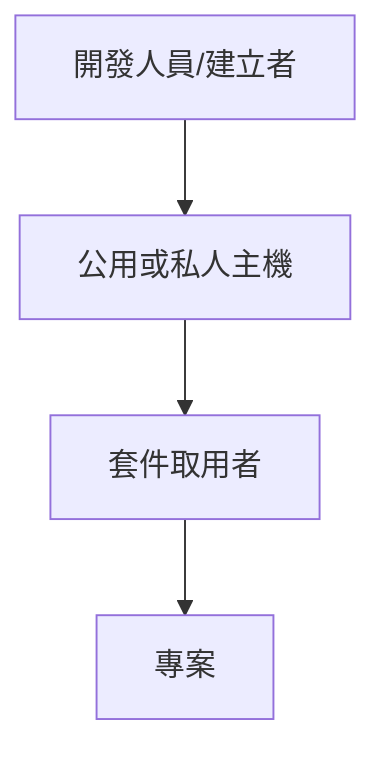

# Rookie Overview

## 1. 協同開發

### 1.1. 版本控制

目的:確保不同人編輯的同一程式檔案都能得到同步。在軟體開發流程中，提供設計者回復到前一狀態的選擇權，追蹤、維護原始碼、檔案以及設定檔等等的改動，並且提供控制這些改動控制權的程式。

#### 1.1.1. 中央式系統

由中央權威管理存取權限

#### 1.1.2. 分散式系統

開發者直接在各自的本地檔案庫工作，並容許多個開發者同時更動同一檔案，而各個檔案庫有另一個合併各個改變的功能。這個方式讓開發者能不靠網路也能繼續工作，也讓開發者有充分的版本控制能力，而不需經中央權威許可。

    ex1:同一程式檔案需求團隊中開發人員同時進行修正同一區塊，可避免檔案覆蓋與衝突。

    ex2:進行debug時，可找出某一版本中出現的特定錯誤，並可比對不同版本的程式碼以找出問題的位置。

##### 1.1.2.1. 工具-git

用於Linux核心開發的版本控制工具(現可用於Windows)，採分散式系統，特點為合併追蹤（merge tracing)。

***區別:
著重在檔案的整體性是否有改變，與CVS或Subversion系統則著重在檔案內容的差異。***

### 1.2. 主要編輯器 VS Code

### 1.3. 文件語言 Markdown

用規定俗成的標記，規定文本的格式、結構等(加粗、分段等)

**輕量級的標記語言-Markdown:**

用一種易讀易寫的純文本格式寫作，並可將其轉換為有效的 XHTML（或 HTML）

- 優點:純文本記錄、不受編輯器限制、簡單易懂

- 缺點:複雜排版需求無法處理

### 1.4. 工作進度掌控 Trello

為一網路版專案管理軟體，以Board&List組成，支援同步、共享，並可跨平台使用。

[使用方法](https://trello.com/zh-Hant/guide/trello-101)

### 1.5. 流程與設計圖 draw.io

跨平台流程圖製作工具，內建大量流程圖圖庫。

### 1.6. 文書工具 google G suite

為一雲端辦公套組，包含信箱、Meet、日曆、試算表、文件、簡報...等 。

---

## 2. 環境

### 2.1 作業系統

- 個人 macOS
- 伺服器 CentOS

### 2.2 開發環境 Docker

為一開放原始碼軟體的平台，用於開發、執行、交付應用，以Linux核心中的資源分離機制來建立獨立的容器(containers)，來提供更強的業界隔離相容，達到打包應用程式及其虛擬容器的靈活性和可攜式性。

[參考資料2.2](https://zh.wikipedia.org/wiki/Docker)

[參考資料2.2-2](https://medium.com/unorthodox-paranoid/docker-tutorial-101-c3808b899ac6)

---

## 3. C\#

### 3.1 IDE - Visual Studio/Rider

#### 3.1.1 檢查工具 - StyleCop

Microsoft Visual Stuido 下的一套 coding style 檢查工具，可以協助檢查目前開啟專案的 C# 程式碼，是否有符合所設定的檢查規則，並自訂團隊的 coding style rules，以確保一致性寫作風格的程式碼。

[參考資料3.1.1](https://dev.twsiyuan.com/2017/02/stylecop.html)

### 3.2 管理套件 NuGet

自由開源軟體包管理系統&可共用的程式碼單位。

由Microsoft 支援的共用程式碼機制，定義如何建立、裝載和取用 .NET 套件，並為這些角色的每一個提供工具。其副檔名為`.nupkg`的zip檔，內含已編譯程式碼 (DLL)、其他與該程式碼相關的檔案，以及包含套件版本號碼這類資訊的描述性資訊清單。

[參考資料3.2](https://docs.microsoft.com/zh-tw/nuget/what-is-nuget)

[參考資料3.2-2](https://zh.wikipedia.org/wiki/NuGet)

### 3.3 開發框架

- ASP.NET Core
  是一種跨平臺、高效能、開放原始碼的架構，可用於建立現代化、具備雲端功能的網際網路連線應用程式。
  - 優點:
    - 建置 Web UI 和 Web API 的統一劇本。

    - 可測試性架構。

    - Razor Pages 更容易撰寫以頁面為焦點的案例程式碼，也更具生產力。

    - Blazor 可讓您在瀏覽器中使用 C# 與 JavaScript。
  
    - 能夠在 Windows、macOS 和 Linux 上開發並執行。

    - 開放原始碼和以社區為焦點。

    - 整合現代化的用戶端架構和開發工作流程。

    - 支援使用gRPC裝載遠端程序呼叫（RPC）服務。

    - 雲端就緒、以環境為基礎的組態系統。

    - 內建的相依性插入。

    - 輕量、高效能且模組化的 HTTP 要求管線。

    - 輕量、高效能且模組化的 HTTP 要求管線。

    - 可裝載於多種開發環境。

    - 並存版本控制。

    - 可簡化現代網頁程式開發的工具。

[參考資料3.3](https://docs.microsoft.com/zh-tw/aspnet/core/introduction-to-aspnet-core?view=aspnetcore-3.1)

---

## 4. JavaScripts(JS,ES6/ES7)

### 4.1 IDE VSCode

#### 4.1.1 Prettier

為一程式碼格式化工具，可設定為存檔時自動格式化，不用再浪費時間手動格式化程式碼，並根據團隊規範，去調整相關設定規則。

#### 4.1.2 ESLint

為一程式碼規範工具，可找到並自動修復JavaScript Code的問題，且有完整的文件規範，適合團隊使用

[參考資料4.1.2](https://eslint.org/)

[參考資料4.1.2-2](https://wcc723.github.io/tool/2017/11/09/coding-style/)

### 4.2 管理套件 npm

為一Nude的套件管理工具

### 4.3 前端模塊打包生成

#### 4.3.1 Webpack

為一開源的前端打包工具，使用載入器來將資源轉化成模組，並透過自訂載入器的順序、格式來因應專案的需求。

[參考資料4.3.1](https://zh.wikipedia.org/wiki/Webpack)

#### 4.3.2 Babel

為JavaScript的編譯器，用於當前或較舊的環境中，轉換為Javascript的兼容版本。

- 優點:

  - 轉換語法

  - 用於實現瀏覽器並不支援的原生API的程式碼在目前的環境中

  - 原始碼的轉換

### 4.4 開發框架

#### 4.4.1 React(React.js/ReactJS)

一個為資料提供彩現為HTML視圖的開源JavaScript 庫。React視圖通常採用包含以自訂HTML標記規定的其他組件的組件彩現。React為程式設計師提供了一種子組件不能直接影響外層組件（"data flows down"）的模型，資料改變時對HTML文件的有效更新，和現代單頁應用中組件之間乾淨的分離。

#### 4.4.2 Redux

用於應用程式狀態管理的開源JavaScript庫。

---

## 5. 自動化測試(JS,ES6/ES7)

### 5.1 IDE VSCode

### 5.2 套件管理 npm

### 5.3 開發語言 JS,ES6/ES7

### 5.4 前端模塊打包生成

### 5.5 開發框架

- Jest
  
  為一前端模擬測試工具，採Unit Test(單元測試)

  - 優點:
  
    - 測試成本較低(相對於E2E Test)

    - 避免修改程式碼後的錯誤

    - 不需要每次修改都重新人工測試

- Headless

- Cucumber
  
  為一自動化的功能測試工具，其能建立一個易讀的，可執行的特性文件。
  使用的語言叫做`Gherkin`,註釋以#開頭，每一個檔案為`.feature`。

- Puppeteer

  網頁爬蟲，預設為headless 模式來執行，在存取網站時不會秀出真正的瀏覽器，爬蟲運行時不會干擾使用者使用電腦。日後要將爬蟲發佈到遠端主機時，headless 模式讓程式發佈更加容易。

- Chai

[參考資料Jest](https://wcc723.github.io/development/2020/02/02/jest-intro/)

[參考資料Cucumber](https://www.itread01.com/content/1544337666.html)

[參考資料Puppeteer](https://michaelchen.tech/puppeteer/why-or-why-not-puppeteer/)

---

- [Rookie Overview](#rookie-overview)
  - [1. 協同開發](#1-協同開發)
    - [1.1. 版本控制](#11-版本控制)
      - [1.1.1. 中央式系統](#111-中央式系統)
      - [1.1.2. 分散式系統](#112-分散式系統)
        - [1.1.2.1. 工具-git](#1121-工具-git)
    - [1.2. 主要編輯器 VS Code](#12-主要編輯器-vs-code)
    - [1.3. 文件語言 Markdown](#13-文件語言-markdown)
    - [1.4. 工作進度掌控 Trello](#14-工作進度掌控-trello)
    - [1.5. 流程與設計圖 draw.io](#15-流程與設計圖-drawio)
    - [1.6. 文書工具 google G suite](#16-文書工具-google-g-suite)
  - [2. 環境](#2-環境)
    - [2.1 作業系統](#21-作業系統)
    - [2.2 開發環境 Docker](#22-開發環境-docker)
  - [3. C\](#3-c)
    - [3.1 IDE - Visual Studio/Rider](#31-ide---visual-studiorider)
      - [3.1.1 檢查工具 - StyleCop](#311-檢查工具---stylecop)
    - [3.2 管理套件 NuGet](#32-管理套件-nuget)
    - [3.3 開發框架](#33-開發框架)
  - [4. JavaScripts(JS,ES6/ES7)](#4-javascriptsjses6es7)
    - [4.1 IDE VSCode](#41-ide-vscode)
      - [4.1.1 Prettier](#411-prettier)
      - [4.1.2 ESLint](#412-eslint)
    - [4.2 管理套件 npm](#42-管理套件-npm)
    - [4.3 前端模塊打包生成](#43-前端模塊打包生成)
      - [4.3.1 Webpack](#431-webpack)
      - [4.3.2 Babel](#432-babel)
    - [4.4 開發框架](#44-開發框架)
      - [4.4.1 React(React.js/ReactJS)](#441-reactreactjsreactjs)
      - [4.4.2 Redux](#442-redux)
  - [5. 自動化測試(JS,ES6/ES7)](#5-自動化測試jses6es7)
    - [5.1 IDE VSCode](#51-ide-vscode)
    - [5.2 套件管理 npm](#52-套件管理-npm)
    - [5.3 開發語言 JS,ES6/ES7](#53-開發語言-jses6es7)
    - [5.4 前端模塊打包生成](#54-前端模塊打包生成)
    - [5.5 開發框架](#55-開發框架)
